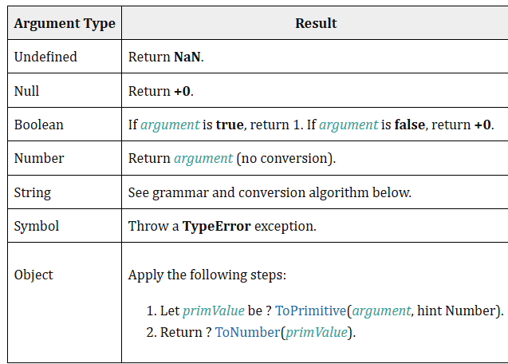
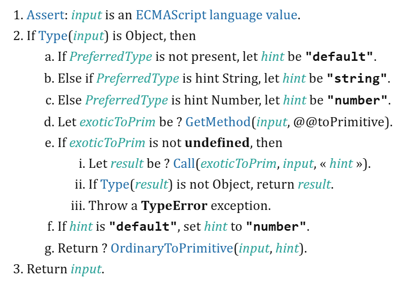
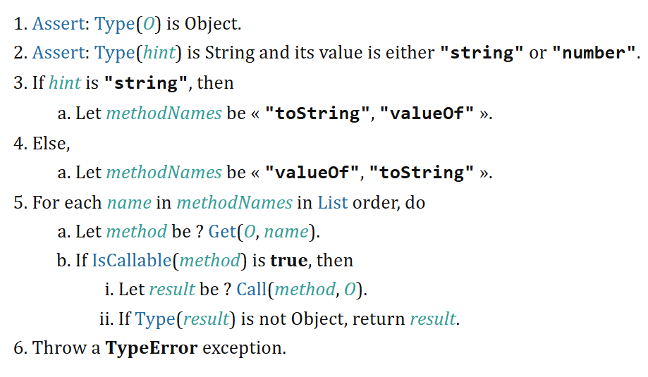

## Abstract Operations — Background Processes in JavaScript

Abstract operations are internal processes that developers cannot directly invoke in JavaScript. They underpin many core language features.

---

### Type Casting / Type Conversion

JavaScript has two types of type conversion:

---

#### 🔹 Implicit Type Casting (Coercion)

Type conversions that happen automatically by JavaScript.

---

##### ➤ ToNumber

- **Subtract operator (-)**:
  - Always performs subtraction, never concatenation.
  - Works only with numbers, so it tries to convert other types to numbers.
  - Strings that can't be parsed become `NaN`.
  - Booleans:
    - `true → 1`
    - `false → 0`
  - `null → 0`
  - `undefined → NaN`
  - Symbols → ❌ Throws **TypeError**


---

##### ➤ ToPrimitive

Converts objects to their primitive value by trying `valueOf()` and `toString()` methods.


---

##### ➤ OrdinaryToPrimitive

Fallback mechanism used by `ToPrimitive`.



- `valueOf()` → Returns the object itself by default.
- `toString()` → Returns a string like `[object Object]`.

---

##### ➤ ToString

Converts any value to a string. This is used in many implicit operations like concatenation.

---

#### 🔹 Explicit Type Casting

Developers manually convert values using global constructors:

```js
String(), Number(), Boolean()
```

---

#### 🔹 Concatenation

when we will use + operator on **string** even if only one parameter is string it will always concatenate. if both parameters are numbers it will do addition.

It means to join two or more Strings

```js
12 + “12”  will be “1212”
```